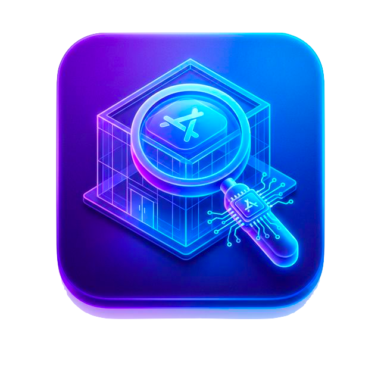

# DevStore Hub 🚀

**DevStore Hub** is a professional-grade App Store Optimization (ASO) and Market Intelligence platform built with Flutter. It serves as a comprehensive "Command Center" for app developers, marketers, and researchers to audit, simulate, and optimize their store presence using data-driven insights.
<p align="center">
  
</p>

---

## 🎯 App Mission & Summary

In the competitive app economy, metadata is your strongest leverage. **DevStore Hub** bridges the gap between raw store data and actionable strategy. It doesn't just display app information; it analyzes it through a sophisticated scoring engine to help you rank higher and convert better.

Whether you are auditing a competitor's strategy, simulating your own pre-launch metadata, or tracking customer sentiment in real-time, this app provides the technical depth required for professional ASO management.

### Deep Dive: Core Intelligence Modules

#### 1. ASO Scoring Engine (Algorithmic Audit)
At the heart of the app is a proprietary weighted scoring engine that evaluates five critical pillars of store success:
- **Title (25%)**: Analyzes keyword density and character utilization (30-char limit optimization).
- **Visuals (20%)**: Audits screenshot counts and cross-device support (iPad/Mac compatibility).
- **Social Proof (25%)**: Measures the authority and trust signals from user ratings and review volume.
- **Description (15%)**: Scans for deep-text optimization and feature highlight efficiency.
- **Freshness (15%)**: Tracks update frequency to ensure active development signals.
  
<br>  

#### 2. The ASO Simulator (Draft Mode)

Our unique **Simulator** allows you to test "what-if" scenarios. You can input experimental titles, descriptions, and asset counts before they go live on the App Store. The simulator generates a predicted ASO score and provides specific recommendations to refine your drafting process, saving you weeks of trial-and-error in the real store.

#### 3. Real-Time Sentiment tracking

Moving beyond stars and ratings, DevStore Hub parses live RSS feeds to perform sentiment analysis on the latest customer feedback.
- **Happiness Metric**: A calculated score reflecting current user satisfaction.
- **Pain Point Identification**: Quickly identify what users hate about competitor apps to find your unique selling proposition (USP).

#### 4. Competitive Gap Analysis

Select any two apps for a side-by-side comparison. This module highlights the competitive advantages of the "winner" and identifies the "gaps" where you can outperform your rivals in search results.

#### 5. Automated Keyword Intelligence

Automatically extract the top 10 most influential keywords from any app's description and analyze their search difficulty. This helps developers identify the high-volume/low-competition "Gold Mine" keywords.


---

## ✨ Key Features

### 🔍 Advanced Search & Discovery
*   **Global Search**: Query the entire iTunes collection with real-time results.
    <br>
    
*   **Granular Filters**: Filter by Store Country (US, UK, JP, CN, etc.), Device Type (iPhone, iPad, Mac), and Search Attributes.
    <br>
*   **Recent History**: Instant access to your previous search queries for faster workflow.
    <br>

### 📱 Deep App Inspection
*   **High-Res Artworks**: View and download 512px and 100px app icons.
    <br>
*   **Screenshot Gallery**: Adaptive horizontal gallery supporting iPhone, iPad, and Apple TV screenshots with smart aspect-ratio detection.
    <br>
*   **Developer Info**: Quick links to developer pages and secondary genres.
    <br>

### 🛠 Utility & Extraction
*   **One-Tap Copy**: Extract Bundle IDs, Track IDs, App Names, and Descriptions instantly.
*   **Full Info Manifest**: Export all available API fields to your clipboard in a formatted string.
*   **Store Links**: Direct access to the official App Store page within the app.
                   

### 🌗 Premium UI/UX
*   **Material 3 Design**: Utilizing the latest design system for a sleek, modern feel.
    <br>
*   **Dark Mode Pro**: Full dark theme support for night-time research sessions.
*   **Adaptive Layout**: Support for both Phone and Tablet/iPad form factors.

---

## 🛠 Tech Stack

| Layer | Technology |
| :--- | :--- |
| **Framework** | [Flutter](https://flutter.dev) (v3.x) |
| **Language** | [Dart](https://dart.dev) |
| **State Management** | [Flutter BLoC](https://pub.dev/packages/flutter_bloc) |
| **Networking** | [Dio](https://pub.dev/packages/dio) |
| **Service Locator** | [GetIt](https://pub.dev/packages/get_it) |
| **Image Loading** | [CachedNetworkImage](https://pub.dev/packages/cached_network_image) |
| **Local Storage** | [SharedPreferences](https://pub.dev/packages/shared_preferences) |
| **Architecture** | Clean Architecture (Data, Domain, Presentation) |

---

## 🚀 Getting Started

### Prerequisites

*   Flutter SDK: `>=3.2.3`
*   Dart SDK: `>=3.2.3 <4.0.0`
*   CocoaPods (for iOS)

### Installation

1. **Clone the repository**
   ```bash
   git clone https://github.com/gkgupta226/devstorehub.git
   cd devstorehub
   ```

2. **Install dependencies**
   ```bash
   flutter pub get
   ```

3. **Run the application**
   ```bash
   # Run in debug mode
   flutter run

   # Build for Android
   flutter build apk --release

   # Build for iOS
   flutter build ios --release
   ```

---

## 📂 Project Structure

```text
lib/
├── core/               # Reusable widgets, constants, loaders, and utils
│   ├── components/     # AdaptiveLoader, CustomText
│   └── res/           # Styles, Colors, Themes
├── features/           # Feature-based modular structure
│   └── search/        # Core Search Feature
│       ├── data/      # Repositories & API sources
│       ├── domain/    # Entities & Use cases
│       └── presentation/ # BLoC & UI Pages (SearchPage, DetailPage)
└── injection_container.dart # Dependency Injection setup
```

---

## 🎨 Design Principles

*   **Responsiveness**: Uses `LayoutBuilder` and `MediaQuery` to adapt the UI for tablets.
*   **Stability**: Leverages `fpdart` for functional error handling.
*   **Fluidity**: Optimized image lists with `BouncingScrollPhysics`.

---

## 🤝 Community & Closed Testing

We are currently in the **Play Store Closed Testing** phase. To ensure the highest quality, we are looking for 20 developers to join our testing group for 14 days.

### Why Join the Testing Group?
- Get early access to premium ASO features.
- Influence the development roadmap.
- Connect with other Flutter developers.

### How to Join
1. **Join our Community**: [Link to Discord/Telegram/Email]
2. **Accept Invite**: Provide your Google Play email via [Form/Email].
3. **Download**: Install the app from Play Store once invited.

### Requirements
- Use the app at least once daily for **14 days**.
- Report any bugs or UI/UX suggestions.

---

## 📅 Daily Progress Tracker

Transparency is key. We update the build daily and track every single feature development.

View our **[Daily Progress Log](DAILY_PROGRESS.md)** to see:
- What was built today.
- Current bugs being squashed.
- Next week's priorities.

---

## 🏗 Roadmap

- [x] Phase 1-4: Core ASO Suite (Scoring, Analysis, Sentiment).
- [ ] Phase 5: Play Store Closed Testing (In Progress).
- [ ] Phase 6: Production Release.
- [ ] Phase 7: AI-Generated Competitor Benchmarking.

---

## 📬 Contact & Support

Want to explore a specific feature or collaborate on app scope?
- **Developer**:https://github.com/gkgupta226
- **Email**: gkgupta226@gmail.com
- **GitHub**: gkgupta226

---

## 📄 License

This project is licensed under the MIT License - see the LICENSE file for details.

---

*Built with ❤️ for the Developer Community.*
